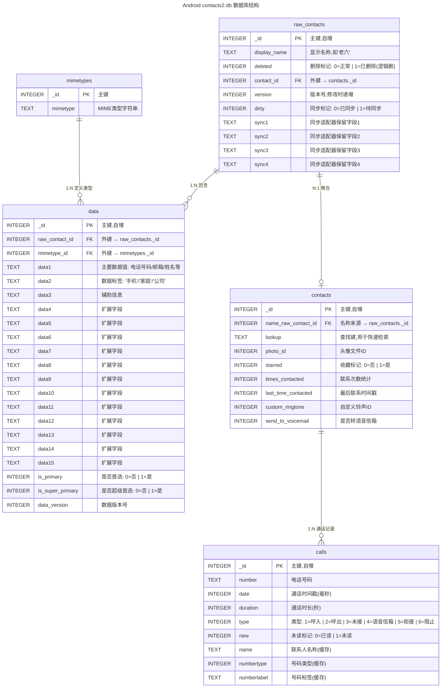

# 獬豸杯（1——手机取证）
> 事先声明：仅供参考 我不知道正确答案，所以不包对哈，要是出错了 还请指出 感谢

## 检材基本信息
| 属性      | 值                                                                |     |
| ------- | ---------------------------------------------------------------- | --- |
| 文件名     | 检材1.tar                                                          |     |
| SHA-256 | f4de5ef2932cf281094163e26acdcb4ce4695497660857dd5f65f6f5a3285b87 |     |
| 格式      | POSIX tar archive (GNU)                                          |     |
| 大小      | 12.5 GB (12,536,389,120 bytes)                                   |     |
| 文件数量    | 49,189                                                           |     |
| 设备品牌    | OnePlus                                                          |     |
| 设备型号    | 一加Ace (PGKM10 / OP5565)                                          |     |
| 硬件平台    | MediaTek Dimensity 8100-MAX (MT6895)                             |     |
| 操作系统    | Android 15 / ColorOS 15                                          |     |
| IMEI1   | 865288068624019                                                  |     |
| Root方案  | KernelSU + LSPosed + TrickyStore                                 |     |
## 一点前置知识点
### 安卓相关标识以及对应的提取路径（~~好像没什么用~~）

| 标识类型                      | 说明                             | 提取文件路径                                                                                          |     |
| :------------------------ | :----------------------------- | :---------------------------------------------------------------------------------------------- | --- |
| **IMEI**                  | 15位全球唯一设备标识，通常双卡设备有IMEI1/IMEI2 | `misc/gjdw/mdm`（设备监控日志）                                                                         |     |
| **序列号 (serialno )**       | 厂商分配的设备流水号                     | `/default.prop`<br>`/system/build.prop`<br>`/vendor/build.prop`<br>`/misc/recovery`(recovery分区) |     |
| **Android ID**            | 64位十六进制字符串，首次启动生成              | `data/data/com.google.android.gms/shared_prefs/Checkin.xml`<br>或 `settings_ssaid.xml`           |     |
| **Google Advertising ID** | 用户可重置的广告标识                     | `data/data/com.google.android.gms/shared_prefs/advertising_id.xml`                              |     |
| **MAC地址**                 | WiFi/蓝牙硬件地址                    | `sys/class/net/wlan0/address`<br>`data/misc/wifi/wpa_supplicant.conf`                           |     |

---

### 安卓手机联系人数据库分析
**路径：`/data/com.android.provides.contacts/databases/contacts2.db`**
数据库结构分析：

这里需要关注这几个表：
- **`raw_contacts`: 联系人主表 包含删除标记 即可以看到曾删除了哪些联系人**
- **`contacts`:聚合后的联系人表**
- **`data`:联系人信息**

---

## 信息收集
在正式开始前先了解一下检材叭，先来看一眼 `./adb/`

发现存在`lspd`和`ksu`目录，说明机主曾经root过机子 并装了KernelSU和LSPosed插件，那么就很省事了

- LSPosed 运行时会记录系统部分属性，存放在`./log/props.txt`，就不需要再去一个个找了
- KernelSU 会保存内核日志，存放在`./log/dmesg.log`

接下来就记一下属性的分级

### 第一级 

| 前缀        | 全称             | 含义                                  |
| :-------- | :------------- | :---------------------------------- |
| `ro`      | **Read Only**  | **只读属性**，系统启动时初始化，运行期不可更改           |
| `persist` | **Persistent** | **持久化属性**，保存到存储介质，重启后保留             |
| `sys`     | **System**     | **系统运行时属性**，动态变化，重启丢失               |
| `dev`     | **Device**     | **设备状态属性**，硬件/驱动运行时状态               |
| `service` | **Service**    | **服务状态属性**，记录系统服务运行状态               |
| `debug`   | **Debug**      | **调试属性**，开发调试用，通常关闭                 |
| `ctl`     | **Control**    | **控制指令属性**，用于 start/stop/restart 服务 |
### 第二级
| 分类                  | 含义            |
| :------------------ | :------------ |
| `sys`               | **System 核心** |
| `build`             | **构建信息**      |
| `product`           | **产品信息**      |
| `boot`              | **启动参数**      |
| `hardware`          | **硬件抽象**      |
| `telephony` / `ril` | **射频/基带**     |
| `vendor`            | **厂商定制**      |
| `config`            | **配置项**       |
| `kernel`            | **内核参数**      |
| `debuggable`        | **调试状态**      |
### 第三级（厂商/定制UI标识）
| 字段               | 含义                 |
| :--------------- | :----------------- |
| `oplus`          | **Oppo/一加/Realme** |
| `miui`           | **小米 MIUI**        |
| `samsung`        | **三星**             |
| `hw` / `harmony` | **华为/鸿蒙**          |
| `google`         | **Google**         |
| `vendor`         | **通用厂商分区**         |
| `odm`            | **ODM 定制**         |
### 第四层
| 字段               | 含义     |
| :--------------- | :----- |
| `serialno`       | 序列号    |
| `model`          | 产品型号   |
| `marketname`     | 市场销售名称 |
| `device`         | 设备代号   |
| `hardware`       | 硬件平台   |
| `fingerprint`    | 构建指纹   |
| `release`        | 版本号    |
| `sdk`            | SDK 级别 |
| `imei`           | IMEI   |
| `boot_completed` | 启动完成标志 |

---

## 解题过程
### 1. 请分析检材1：手机的序列号是什么？【答案格式：AB65CDEFG6HIJKLM,字母全部大写】
这个题有一个很简单的思路，根目录爆搜
```bash
grep -rE "serialno" ./*
```
直接搜到答案`AM69VKKVU4CMGELB`

正常一点的做法是 刚刚有提到过的两个插件
- 翻`/adb/lspd/log/props.txt` 但是会发现似乎被抹了

- 接着翻内核日志 `/adb/ksu/log/dmesg.log` 翻到了（）

### 2.请分析检材1：该手机的具体型号是什么？【答案格式：小米17至尊版】
同样，最简单的方式
```bash
grep -r "product.model" 2>/dev/null
```
这时候注意到一个奇怪的东西

注意到这个
`adb/modules/AIHZ_GJX/system.prop:ro.product.model=PLC110`
很奇怪的模块对吧，这个时候留心过去看一眼

很坏，竟然改了型号 但是没事回到刚刚搜到的结果
能看到`debuglogger/mobilelog/APLog_2010_0102_111608__1/properties:[ro.product.model]: [PGKM10]`
日志总是可信的 于是就有了真正的答案 `PGKM10` 也就是 一加ACE
当然，可以验证一下

SOC型号`MT6895Z`正好对应一加ACE的天玑8100
### 3.请分析检材1：手机中已删除的联系人手机号码是什么？【答案格式：12345678910】
记得`contacts2.db`的结构哈 既然要找已删除的联系人 那就来翻`raw_contacts`找到`deleted`标识为1的那位


老六
现在去`data`，翻他的手机号


找到啦 `13696966666`
### 4.请分析检材1：手机中找到密码本文件，计算其MD5哈希值，取后6位，字母大写。【答案格式：EF3898】
找到我们的密码本（这个熟悉安卓的应该有直觉 没直觉就多翻几个文件）

然后计算

答案 `AD3563`
### 5.请分析检材1：嫌疑人下载的图片隐写工具名称是什么？【答案格式：outguess.zip，英文小写】
来看`Download`

很明显了 答案是 `steghide-0.5.1-win32.zip`
### 6.请分析检材1：嫌疑人使用隐写工具进行文件隐写密码是什么？【答案格式：ABCD@202002】
既然是隐写，那肯定是以图片为载体，先找图片 看两个地方
- `./DCIM/Camera`
- `./Pictures`

`Pictures` 下平平无奇 反倒 `./DCIM/Camera` 下有一个可疑的`important.jpg`
看一眼

果然，拿密码本爆一下 

轻松拿到`JHTJ@202605`

补充一点 `17785747148230.png`是个二维码 解码结果是
`{"type":"personal","userID":"17706223971","nick":"搁浅","timestamp":1778574712018}`
先记着
### 7.请分析检材1：嫌疑人向数据贩子购买公民个人信息共计多少条？【答案格式：123】
~~emmm....个人感觉这题出的不是很好，和上题目跨度有点大~~
好 先找机主和数据贩子交流的平台，来到`data` 目录 然后筛掉系统包
```bash
ls data/ | grep -Ev "oplus|coloros|google|android|mediatek|oppo|microsoft|heytap"
```

注意这个`com.lianqujiaoyou.chat`虽然不知道是什么应用 但是都带`chat`了 那肯定是聊天的嘛
也可以查一下

嗯....挺好
接着来看他的包结构
注意这个

介绍一下OpenIM啊 一个开源的即时通讯框架
好 看看这个库

这里有一个100条（真抠搜）接着看   

注意这个 接着去i聊 网上查一下i聊的包名 

`uni.app.UNI04963C4`
好 来看包结构

注意这个`msg_0.db`（要有敏感性，msg->message）

还真是`100`
### 8.请分析检材1：嫌疑人向数据贩子交易时使用的付款方式是什么？【答案格式：支付宝】
接上题的图 （其实下面一题题干明说了，绷不住）
`银行卡`
### 9.请分析检材1：数据贩子交易过程中提供的银行卡号是多少？【答案格式：6222351234482925678】
接上上题的图
`6222355973482923738`
### 10.请分析检材1：接上题，嫌疑人所使用聊天工具的用户 ID 是多少？【答案格式：12345】
其实这题有个疑议的 
针对i聊来说是`17706223971` 就是之前扫码扫出来的那个，当然数据库里也能验证

针对连趣来说是`1355997814`


主要感觉连趣更像交友平台 不大像纯粹的聊天应用 
所以呢我就更倾向于i聊，也就是`17706223971`  

### 11.请分析检材1：嫌疑人使用浏览器访问了该下载链接，该浏览器对应的包名是什么？【答案格式：com.heytap.market】
好啦 这里要去看他下载了哪些浏览器 （日常羡慕火眼）
简单筛一下叭
```bash
ls data | grep -E browser
```

两个浏览器 第一个 `com.heytap.browser` 也就是coloros自带浏览器的`hst.db`是空的，不用管 
看下一个

来看这个，`Cookies` 什么意义不多说啦 

cookies 里存在大量的百度网盘记录 那答案就很明了了
`com.meiit.browser`
### 12.请分析检材1：嫌疑人于何时下载数据商人发送的数据压缩包文件？【答案格式：2022-02-02 12:00:00】
来翻百度网盘 `com.baidu.netdisk`
来看这个库

可以看到`download_tasks`表，里边就一条数据

正好有`date`字段

换算一下

就有答案啦 `2026-05-12 17:00:05`
### 13.请分析检材1：接上题，该压缩包的解压密码是什么？【答案格式：根据实际值填写】
回到i聊

很明显啦 要找手机号啦~ 那就是i聊的ID嘛 `17706223971` 试了一下 果然成功解压了，拿到数据.xlsx

### 14.分析检材1：接上题，年龄在 40 至 60 岁（含 40、60 岁）的富豪共有多少人？【答案格式：123】
这个就是excel的基础操作了，排序或者筛选都行 


最后答案是`46`
### 15.综合分析：请找出嫌疑人筛选的重点客户名单，并统计名单内共有多少人？【答案格式：1】
还记得之前那个图片隐写嘛？里面是一个z01分卷儿 ，打开后能看到

然后 想办法解压出来 
```powershell
PS D:\獬豸杯\检材1> 7z x .\stego_out.z01 -oimportant_client -y -aos
```
用7z将残缺的xlsx强制解压出来 
接着再用7z强制解压xlsx
```powershell
PS D:\獬豸杯\检材1\important_client> 7z x .\重点客户.xlsx.zip -odata -y -aos
```
接着来看这个文件(`workbook.xml`)

打开就能看到他筛出来的重点用户信息 

然后就是数数环节
最后数出来是 `5` 

---
